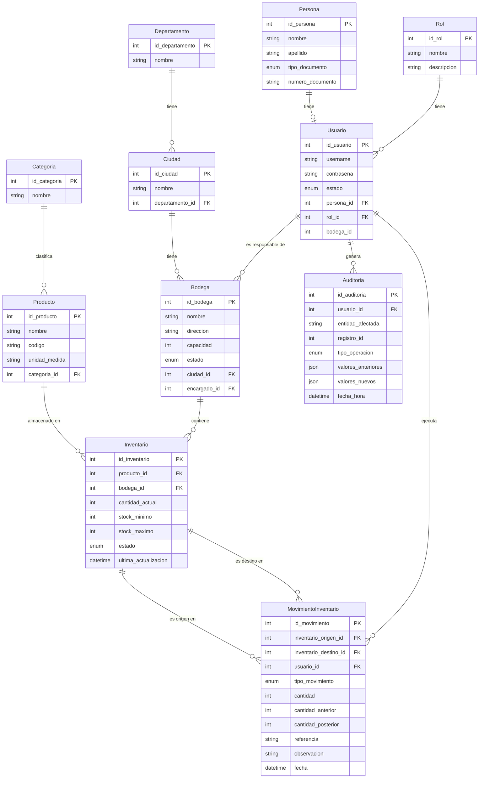

# Base de Datos — LogiTrack

## Motor
- **MySQL 8.4**
- **Nombre de la base de datos:** `LogiTrack`

---

## Modelo Entidad-Relación



---

## Descripción de Tablas

### Persona
Almacena los datos personales de las personas del sistema. Cada usuario del sistema debe estar asociado a una persona.

| Campo | Tipo | Descripción |
|-------|------|-------------|
| id_persona | INT PK | Identificador único |
| nombre | VARCHAR(100) | Nombre de la persona |
| apellido | VARCHAR(100) | Apellido de la persona |
| tipo_documento | ENUM | CC, CE, PASAPORTE, NIT, TI |
| numero_documento | VARCHAR(20) UNIQUE | Número de documento único |

---

### Rol
Define los perfiles de acceso del sistema.

| Campo | Tipo | Descripción |
|-------|------|-------------|
| id_rol | INT PK | Identificador único |
| nombre | VARCHAR(50) UNIQUE | ADMIN, SUPERVISOR, OPERARIO |
| descripcion | VARCHAR(255) | Descripción del rol |

---

### Usuario
Representa los usuarios que pueden autenticarse en el sistema. Implementa `UserDetails` de Spring Security.

| Campo | Tipo | Descripción |
|-------|------|-------------|
| id_usuario | INT PK | Identificador único |
| username | VARCHAR(50) UNIQUE | Nombre de usuario para login |
| contrasena | VARCHAR(255) | Hash BCrypt de la contraseña |
| estado | ENUM | ACTIVO, INACTIVO |
| persona_id | INT FK | Referencia a Persona |
| rol_id | INT FK | Referencia a Rol |
| bodega_id | INT FK | Bodega asignada (solo OPERARIO) |

> **Nota:** La contraseña se almacena como hash BCrypt — nunca en texto plano.

---

### Departamento
Entidad geográfica de primer nivel para clasificar ciudades.

| Campo | Tipo | Descripción |
|-------|------|-------------|
| id_departamento | INT PK | Identificador único |
| nombre | VARCHAR(100) UNIQUE | Nombre del departamento |

---

### Ciudad
Entidad geográfica de segundo nivel, pertenece a un departamento.

| Campo | Tipo | Descripción |
|-------|------|-------------|
| id_ciudad | INT PK | Identificador único |
| nombre | VARCHAR(100) | Nombre de la ciudad |
| departamento_id | INT FK | Referencia a Departamento |

---

### Bodega
Representa los almacenes físicos del sistema. Cada bodega tiene una capacidad máxima y un encargado.

| Campo | Tipo | Descripción |
|-------|------|-------------|
| id_bodega | INT PK | Identificador único |
| nombre | VARCHAR(100) | Nombre de la bodega |
| direccion | VARCHAR(255) | Dirección física |
| capacidad | INT | Capacidad máxima en unidades |
| estado | ENUM | ACTIVO, INACTIVO |
| ciudad_id | INT FK | Ciudad donde se ubica |
| encargado_id | INT FK | Usuario responsable |

---

### Categoria
Clasifica los productos del catálogo.

| Campo | Tipo | Descripción |
|-------|------|-------------|
| id_categoria | INT PK | Identificador único |
| nombre | VARCHAR(100) UNIQUE | Nombre de la categoría |

---

### Producto
Catálogo de productos del sistema. Un producto puede estar en múltiples bodegas a través del inventario.

| Campo | Tipo | Descripción |
|-------|------|-------------|
| id_producto | INT PK | Identificador único |
| nombre | VARCHAR(100) | Nombre del producto |
| codigo | VARCHAR(50) UNIQUE | Código único del producto |
| unidad_medida | VARCHAR(30) | UNIDAD, KG, LT, etc. |
| categoria_id | INT FK | Referencia a Categoria |

---

### Inventario
Relaciona productos con bodegas y controla el stock. La combinación `(producto_id, bodega_id)` es única — un producto no puede tener dos registros en la misma bodega.

| Campo | Tipo | Descripción |
|-------|------|-------------|
| id_inventario | INT PK | Identificador único |
| producto_id | INT FK | Referencia a Producto |
| bodega_id | INT FK | Referencia a Bodega |
| cantidad_actual | INT | Stock disponible actual |
| stock_minimo | INT | Umbral de alerta crítica |
| stock_maximo | INT | Límite máximo permitido |
| estado | ENUM | ACTIVO, INACTIVO |
| ultima_actualizacion | DATETIME | Fecha del último cambio |

> **Restricción:** `UNIQUE (producto_id, bodega_id)` — evita duplicados de producto por bodega.

---

### MovimientoInventario
Registro inmutable de todos los movimientos de stock. **No permite UPDATE ni DELETE** (protegido por triggers).

| Campo | Tipo | Descripción |
|-------|------|-------------|
| id_movimiento | INT PK | Identificador único |
| inventario_origen_id | INT FK | Inventario de origen (nullable) |
| inventario_destino_id | INT FK | Inventario de destino (nullable) |
| usuario_id | INT FK | Usuario que ejecutó el movimiento |
| tipo_movimiento | ENUM | ENTRADA, SALIDA, TRASLADO, AJUSTE |
| cantidad | INT | Unidades del movimiento |
| cantidad_anterior | INT | Stock antes del movimiento |
| cantidad_posterior | INT | Stock después del movimiento |
| referencia | VARCHAR(100) | Código de referencia (ej. OC-001) |
| observacion | TEXT | Descripción opcional |
| fecha | DATETIME | Fecha y hora del movimiento |

**Lógica por tipo de movimiento:**

| Tipo | Origen | Destino | Efecto |
|------|--------|---------|--------|
| ENTRADA | NULL | Requerido | Suma stock al destino |
| SALIDA | Requerido | NULL | Resta stock al origen |
| TRASLADO | Requerido | Requerido | Resta origen, suma destino |
| AJUSTE | Requerido | NULL | Fija el stock al valor dado |

---

### Auditoria
Registro histórico de cambios en el sistema. **No permite UPDATE ni DELETE** (protegido por triggers).

| Campo | Tipo | Descripción |
|-------|------|-------------|
| id_auditoria | INT PK | Identificador único |
| usuario_id | INT FK | Usuario que realizó el cambio |
| entidad_afectada | VARCHAR(100) | Nombre de la tabla modificada |
| registro_id | INT | ID del registro afectado |
| tipo_operacion | ENUM | INSERT, UPDATE, DELETE |
| valores_anteriores | JSON | Estado del registro antes del cambio |
| valores_nuevos | JSON | Estado del registro después del cambio |
| fecha_hora | DATETIME | Fecha y hora del evento |

---

## Constraints y Restricciones

### Unique Constraints
```sql
Persona.numero_documento     -- documento único por persona
Rol.nombre                   -- nombre único por rol
Usuario.username             -- username único
Producto.codigo              -- código único por producto
Categoria.nombre             -- nombre único por categoría
Departamento.nombre          -- nombre único por departamento
Inventario(producto_id, bodega_id) -- un producto por bodega
```

### Check Constraints
```sql
Bodega.capacidad > 0         -- capacidad siempre positiva
```

### Dependencia Circular — Solución
`Usuario` y `Bodega` se referencian mutuamente. Se resuelve creando `Usuario` sin la FK a `Bodega` y agregándola después con `ALTER TABLE`:

```sql
CREATE TABLE Usuario (..., bodega_id INT); -- sin FK
CREATE TABLE Bodega  (..., encargado_id INT FK → Usuario); -- FK a Usuario ✅
ALTER TABLE Usuario ADD CONSTRAINT fk_usuario_bodega
    FOREIGN KEY (bodega_id) REFERENCES Bodega(id_bodega); -- FK a Bodega ✅
```

---

## Triggers de Protección

Los registros de `MovimientoInventario` y `Auditoria` son **inmutables por diseño** — actúan como bitácoras del sistema y no deben poder modificarse ni eliminarse, ni siquiera con acceso directo a la base de datos.

```sql
-- Protege MovimientoInventario
trg_proteger_movimiento_update  → BEFORE UPDATE → SIGNAL error
trg_proteger_movimiento_delete  → BEFORE DELETE → SIGNAL error

-- Protege Auditoria
trg_proteger_auditoria_update   → BEFORE UPDATE → SIGNAL error
trg_proteger_auditoria_delete   → BEFORE DELETE → SIGNAL error
```

---

## Datos de Prueba

El script incluye datos iniciales para facilitar las pruebas:

| Entidad | Cantidad |
|---------|----------|
| Roles | 3 (ADMIN, SUPERVISOR, OPERARIO) |
| Personas | 7 |
| Usuarios | 7 (1 admin, 2 supervisores, 4 operarios) |
| Departamentos | 5 |
| Ciudades | 10 |
| Categorías | 5 |
| Bodegas | 5 (4 activas, 1 inactiva) |
| Productos | 10 |
| Inventarios | 19 |
| Movimientos | 14 |

### Credenciales de prueba

| Usuario | Contraseña | Rol |
|---------|------------|-----|
| david.admin | admin123 | ADMIN |
| kike.supervisor | admin123 | SUPERVISOR |
| andres.operario | operario123 | OPERARIO |

---

## Ejecución del Script

```bash
# Desde MySQL Workbench o CLI
mysql -u root -p < SQL/script/sql_script.sql

# O desde MySQL CLI directamente
mysql -u root -p
source /ruta/al/script/sql_script.sql;
```

---

## Equipo de Desarrollo
- **Base de datos:** Enrique Corpus
- **Fecha:** Marzo 2026
